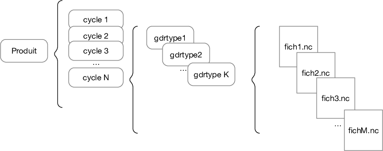

.. _db_structure_ref:

Structure de la base de données CTOH
====================================

Le terme "base de données CTOH" est utilisé au sens large, et ne
fait *pas* référence à une base de données relationnelle (type *Postgres*)
ni objet.

Aujourd’hui (2020/07/02), la base de données CTOH est simplement une collection de fichiers répartis sur un ensemble hétérogène de disques,
et unifiée via des liens symboliques. 

Principes de base
-----------------

La base de données a été construite selon les principes suivants :

    - le point d’entrée à la base de données est un fichier catalogue qui se trouve à un endroit référencé par la variable d’environnement $GDR (/data/usrcto/ctoh/gdr).
    - le catalogue décrit un ensemble de produits disponibles ;
    - chaque utilisateur peut définir un ou plusieurs catalogues propres à lui – c’est la façon standard de gérer des produits de recherche, en beta-test.  Quand ils sont prêts, ils intègrent le catalogue général ; 
    - un produit est, virtuellement, un fichier netCDF et il est définit par le nom du produit, son cycle (et éventuellement sous-cycle), et son numéro de trace.
    - chaque produit à un chemin de données associé, des gdrtypes, et des conventions de nommage. 
    - en réalité, le fichier-produit (virtuel) n’existe pas en tant que tel ; il est éclaté en plusieurs gdrtypes, chacun étant bien un fichier netCDF.  Un fichier-produit est donc l’union potentielle de tous les fichiers gdrtypes.  Pour pouvoir faire cette union de fichiers netCDF, les variables de dimensions doivent être identiques pour tous les gdrtypes .
    - chaque fichier netcdf gdrtype est donc un fichier netCDF complet et il doit pouvoir être visualisé, traité ou mise à jour de façon indépendante des autres.
    - les droits d’accès aux fichiers sont ceux des fichiers unix.  En pratique, pour accéder aux produits qui sont stockés sur /data/ctoh il faut appartenir au groupe unix ctoh, et idem pour usrcto.  Le groupe ctoh est un sous-ensemble de usrcto.

    Vue simplifiée de l'organisation de produits en cycles, gdrtypes et fichiers.
